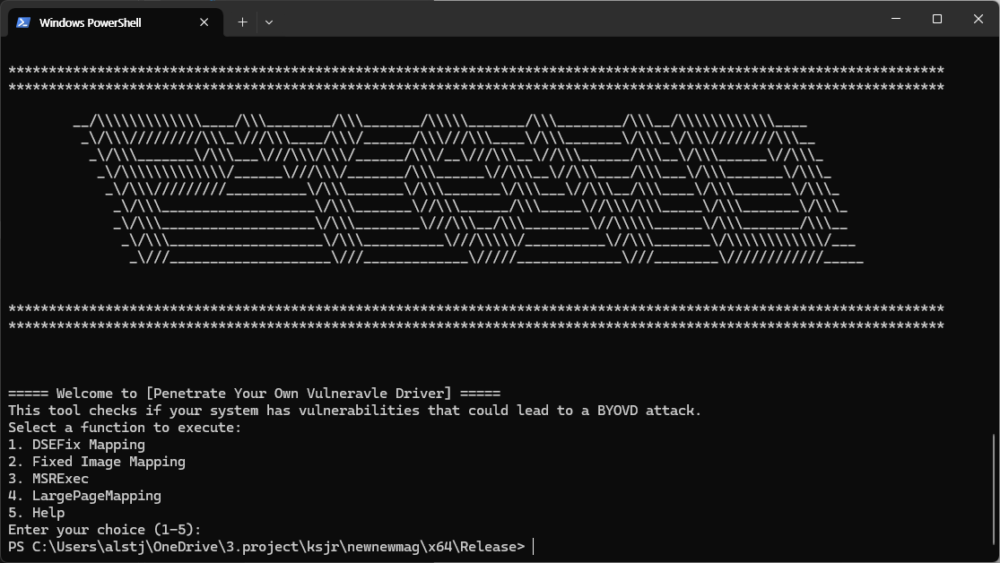

# Project MAGENTA

Project MAGENTA is an integrated penetration testing tool that diagnoses the possibity of BYOVD(Bring Your Own Vulnerable Driver) attacks on your system. This comprehensive toolset includes several utilities to test and analyze various driver vulnerabilities on x64 Windows 10 systems.

# PYOTD
## Prerequisites
x64 windows 10

## How it work
This tool is used to test and analyze various driver vulnerabilities.
Below are the four features this tool includes:

- DSEFix
    - It uses WinNT/Turla VirtualBox kernel mode exploit technique to overwrite global system variable controlling DSE behavior, which itself located in kernel memory space.
- Fixed Image
    - Fixed Image is a simple tool that exploits iqvw64e.sys Intel driver to manually map non-signed drivers in memory
- MSREXEC
    - msrexec is a tool that can be used to elevate arbitrary MSR writes to kernel execution on 64 bit Windows-10 systems. This tool is part of the VDM (vulnerable driver manipulation) namespace and can be integrated into any prior VDM tool. Although this tool falls under the VDM namespace, Voyager and bluepill can be used to provide arbitrary wrmsr writes.
- LPMAPPER
    - Allocate memory to make the `data section` of Windows' own drivers, such as `beep.sys`, executable without having to raise the driver, allowing code to be allocated and executed



## References

- [DSEFix](https://github.com/hfiref0x/DSEFix?tab=readme-ov-file)
- [Fixed Image](https://github.com/TheCruZ/kdmapper)
- [MSREXEC](https://github.com/backengineering/msrexec)
- [LPMAPPER](https://github.com/VollRagm/lpmapper)

## Blog
[Driver Manual Mapping](https://glowing-jewel-096.notion.site/Driver-Manual-Mapping-f0f51d7a8c7f4c5a9cbde6de1e2ac1d0)


***
***

# SYOVD

This tool is designed to detect vulnerable drivers on a Windows system. It performs the following tasks:
1. Queries and hashes local system drivers.
2. Retrieves and parses updated vulnerable driver lists from the web.
3. Matches local drivers against known vulnerable drivers using both name and hash.
4. Displays the results and saves them to CSV files.
5. Analyzes matched drivers further and saves the analysis to additional CSV files.

## Table of Contents

- [Prerequisites](#prerequisites)
- [Installation](#installation)
- [Usage](#usage)
- [Files](#files)
- [Functions](#functions)
- [Contributing](#contributing)
- [License](#license)

## Prerequisites

This tool requires the following:
- Python 3.x
- Windows operating system

## Installation

First, clone this repository to your local machine:

```sh
git clone https://github.com/https://github.com/kyusieun/Project_MAGENTA.git
cd SYOVD
```

Next, install the required Python packages using pip:
```sh
pip install requests beautifulsoup4 pefile pandas
```
Usage

To run the tool, execute the following command:
```sh
python3 syovd.py
```

Files

-	syovd.py: Main script containing all functions and the main execution flow.

# Contributing

### Important Notice

This tool is intended solely for educational purposes and should be used only in a lawful manner. Unauthorized or malicious use of this tool is strictly prohibited. Ensure that you have the appropriate permissions and legal rights to analyze the system you are testing.

### Disclaimer

This project is provided for educational purposes only. The authors do not condone the use of this tool for any illegal or unethical activities. Use this tool at your own risk. The authors are not responsible for any damage or legal consequences resulting from the use of this tool.

### Guidelines for Contributing

If you would like to contribute to the project, please follow these guidelines:

1. **Educational Use Only**: Contributions should be aimed at improving the educational value of the project. Ensure that any additions or modifications serve to enhance the learning experience.
2. **Legal Compliance**: Ensure that your contributions do not violate any laws or regulations. This includes, but is not limited to, respecting intellectual property rights and user privacy.
3. **Ethical Use**: Use this tool responsibly and ethically. Do not use it to target systems without explicit permission from the owner.
4. **Security Best Practices**: Adhere to security best practices in your contributions. This tool deals with sensitive operations, and it is crucial to ensure that no additional vulnerabilities are introduced.

By contributing to this project, you agree to adhere to these guidelines and to use the tool in a responsible and ethical manner.
